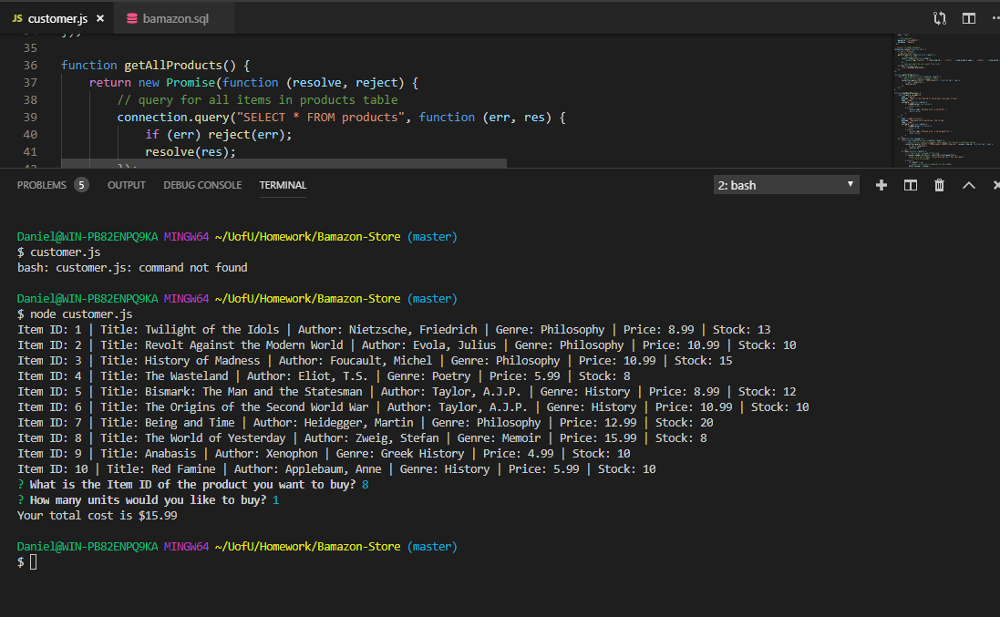
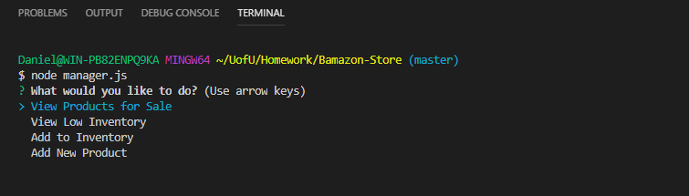
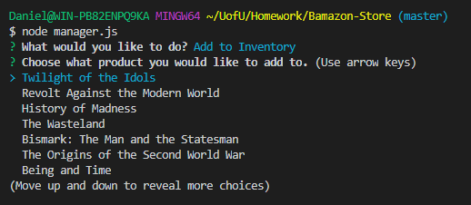
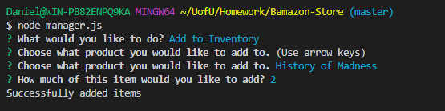
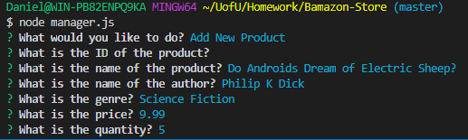

# <b>CLI "Bamazon" Bookstore</b>

This is a node command line interface (commonly known as CLI) which a customer can buy books in the current inventory. A customer can see current inventory, price for each book, and current quantity. A total is displayed total and the current inventory is adjusted. 
 

## <b>How To Use</b>

In order to run the CLI Bookstore you must run the program customer.js in the command line of node. You will be shown the current inventory and current price for each book. You can then add each item you want to purchase to your cart. From there, it will ask if you would like to continue shopping or to checkout.

### <b>Help</b>

Select help when prompted and the console will log information to inform or remind the user of acceptable arguments.
 

## <b>Install This Program</b>

Clone this repository.

You must create API Keys from [Spotify,](https://developer.spotify.com/my-applications/#!/) [Bands In Town,](http://www.artists.bandsintown.com/bandsintown-api) and [OMDb.](http://www.omdbapi.com/apikey.aspx)

Create a .env file in this format with your API Keys instead of where it says API Key. Spotify requires an ID key and a secret Key.

Open up your folder container the Storefront files in the command line. **'CTRL + `** 

Type **'npm install'**

And then your file should be good to go. You can now type your arguments in to the command line.
  

## <b>Working Examples</b>

Here is a visual example from the customer.js file. It displays the store's inventory, which item was purchased, and the total cost:

As you can see, the database is responsive to the input of the user displaying both the item selected, the quantity selected and the final price.

The Bamazon store front also has a manager CLI. Here is an example of the four options available to the manager:

The "View Products for Sale" option will display the same list that is available to the customer when the customer.js is opened in the terminal (or the screen shot above).

The "Add to Inventory" option is self-explanatory as it allows you as the acting manager to add your desired quantity to any item:

Here is an example of adding two books to the "History of Madness" product:

And finally, here is the set of questions generated when selecting the "Add New Product" option as the manager:

